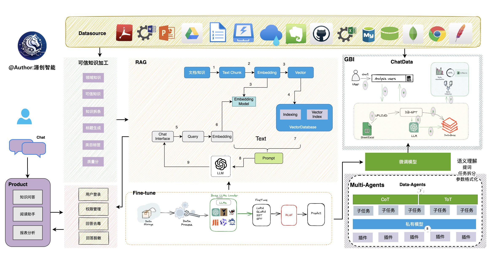
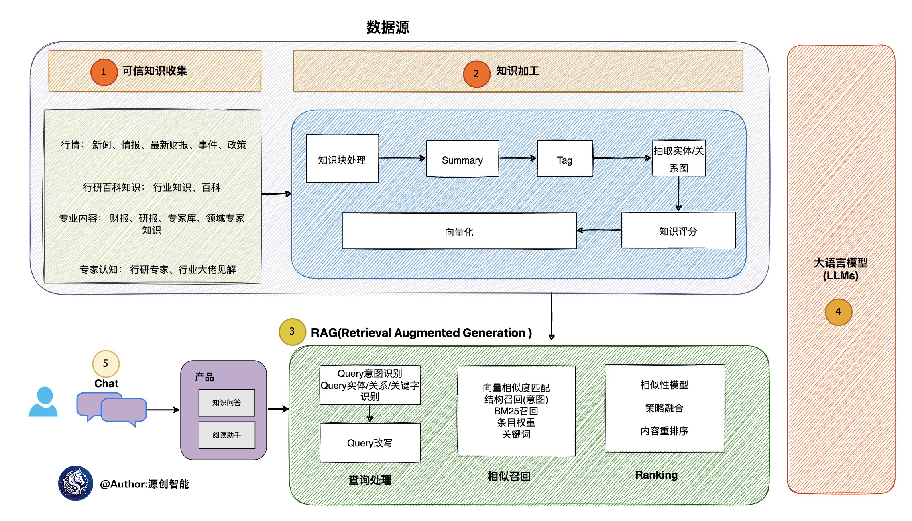
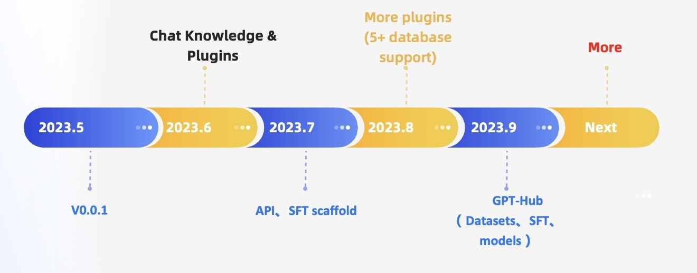

# Bai Ze Zhi Yu: Defining the next generation of interaction with private LLM technology

  

## What is BAIZEAI?

Bai Ze Zhiyu is an open source big model framework in the database field. Its purpose is to build the infrastructure in the big model field. By developing multiple technical capabilities such as multi-model management, Text2SQL effect optimization, RAG framework and optimization, Multi-Agents framework collaboration, etc., it makes it easier and more convenient to build big model applications around the database.

In the Data 3.0 era, based on models and databases, enterprises/developers can build their own exclusive applications with less code.

## Table of contents

- [Architecture plan](#Architecture plan)
- [Feature Introduction](#Feature Overview)
- [Roadmap](#Roadmap)

## Features at a Glance

- **Private Domain Q&A & Data Processing & RAG**

  Supports custom knowledge base construction through built-in, multi-file format upload, plug-in self-crawling, etc., and unified vector storage and retrieval of massive structured and unstructured data

- **Multiple Data Sources & GBI**

  It supports natural language interaction with multiple data sources such as Excel, databases, data warehouses, and supports analytical reports.

- **Automated fine-tuning**

  An automated and lightweight fine-tuning framework built around large language models, Text2SQL datasets, and fine-tuning methods such as LoRA/QLoRA/Pturning, making TextSQL fine-tuning as easy as an assembly line.

- **Data-driven Agents plugin**

  Supports custom plug-ins to execute tasks, natively supports the Auto-GPT plug-in model, and the Agents protocol adopts the Agent Protocol standard

- **Multi-model support and management**

  Supports a large number of models, including dozens of large language models such as open source and API proxy. Such as LLaMA/LLaMA2, Baichuan, ChatGLM, Wenxin, Tongyi, Zhipu, etc. Currently supports the following models:

  - New supported models
    - 🔥🔥🔥 [SOLAR-10.7B](https://huggingface.co/upstage/SOLAR-10.7B-Instruct-v1.0)
    - 🔥🔥🔥 [Mixtral-8x7B](https://huggingface.co/mistralai/Mixtral-8x7B-Instruct-v0.1)
    - 🔥🔥🔥 [Qwen-72B-Chat](https://huggingface.co/Qwen/Qwen-72B-Chat)
    - 🔥🔥🔥 [Yi-34B-Chat](https://huggingface.co/01-ai/Yi-34B-Chat)
  - Support online agent model
    - [x] [OpenAI ChatGPT](https://api.openai.com/)
    - [x] [Baichuan](https://platform.baichuan-ai.com/)
    - [x] [Ali Tongyi](https://www.aliyun.com/product/dashscope)
    - [x] [Baidu Wenxin](https://cloud.baidu.com/product/wenxinworkshop?track=dingbutonglan)
    - [x] [Zhipu·ChatGLM](http://open.bigmodel.cn/)
    - [x] [iFlytek Spark](https://xinghuo.xfyun.cn/)
    - [x] [Google Bard](https://bard.google.com/)
    - [x] [Google·Gemini](https://makersuite.google.com/app/apikey)

- **Privacy and Security**

  The privacy and security of data is ensured through various technologies such as privatized large models and proxy desensitization.

## Architecture

The entire Bai Ze Zhi Yu architecture is shown in the figure below:

  

The core competencies mainly include the following parts:

- **RAG (Retrieval Augmented Generation)**, RAG is the field with the most current implementation and is also the most urgent. Bai Ze Zhiyu has currently implemented a set of RAG-based frameworks, and users can build knowledge applications based on Bai Ze Zhiyu's RAG capabilities.

- **GBI**: Generative BI is one of the core capabilities of the Bai Ze Zhi Yu project, providing basic digital technology support for building enterprise report analysis and business insights.

- **Fine-tuning framework**: Model fine-tuning is an indispensable capability for any enterprise to land in vertical and segmented fields. Bai Ze Zhi Yu provides a complete fine-tuning framework to achieve seamless connection with Bai Ze Zhi Yu project. In the recent fine-tuning, the accuracy rate based on spider has reached 82.5%

- **Data-driven Multi-Agents framework**: Bai Ze Zhi Yu provides a data-driven self-evolution fine-tuning framework, with the goal of making decisions and executing based on data continuously.

- **Data Factory**: In the era of big models, data factories are mainly responsible for cleaning and processing trusted knowledge and data.

- **Data source**: Connect to various data sources to achieve seamless connection of production business data to Bai Ze Zhi Yu’s core capabilities.

### RAG production implementation architecture

  

### Multi-language switching

In the .env configuration file, modify the LANGUAGE parameter to switch to a different language. The default is English (Chinese zh, English en, other languages ​​to be added)

# route map

  

### Knowledge base RAG search optimization

- [x] Multi Documents
  - [x] PDF
  - [x] Excel, csv
  - [x] Word
  - [x] Text
  - [x] MarkDown
  - [ ] Code
  - [ ] Images
- [x] RAG
- [ ] Graph Database
  - [ ] Neo4j Graph
  - [ ] Nebula Graph
- [x] Multi Vector Database
  - [x] Chroma
  - [x] Milvus
  - [x] Weaviate
  -[x] PGVector
  - [ ] Elasticsearch
  - [ ] ClickHouse
  - [ ] Faiss

### Multiple data source support

- Supported data sources

  - [x] MySQL
  - [x] PostgresSQL
  - [x] Spark
  - [x] DuckDB
  - [x] Sqlite
  - [x] MSSQL
  - [x] ClickHouse
  - [x] StarRocks
  - [ ] Oracle
  - [ ] Redis
  - [ ] MongoDB
  - [ ] HBase
  - [x] Doris
  - [ ] DB2
  - [ ] Couchbase
  - [ ] Elasticsearch
  - [ ] OceanBase
  - [ ] TiDB

### Multi-model management and inference optimization

- [x] Cluster deployment
- [x] Fastchat support
- [x] vLLM support
- [x] Upper layer interface compatible with OpenAI
- [ ] Cloud native environment and Ray environment support
- [ ] Registration center introduces nacos
- [ ] Embedding model expansion and optimization

### Agents and Plugin Market

- [x] Multi-Agents Framework
- [x] Custom Agents
- [x] Plugin Market
- [ ] CoT integration
- [ ] Rich plug-in sample library
- [ ] Support AutoGPT protocol
- [ ] Multi-agents & visualization capabilities are integrated to define a new standard for LLM+Vis

### Testing and Evaluation Capacity Building

- [ ] Data text set of knowledge base
- [ ] Problem set [easy, medium, hard]
- [ ] Scoring mechanism
- [ ] Test and evaluation of Excel + DB library table

### Cost and Observability

- [x] debugging
- [ ] Observability
- [ ] Reasoning budget

### Text2SQL fine-tuning

- support llms
  - [x] LLaMA
  - [x] LLaMA-2
  - [x] BLOOM
  - [x] BLOOMZ
  - [x] Falcon
  - [x] Baichuan
  - [x] Baichuan2
  - [x] InternLM
  - [x] Qwen
  - [x] XVERSE
  - [x] ChatGLM2

- SFT model accuracy
  As of 20231010, after fine-tuning the open-source 13B model in this project, the execution accuracy on the Spider evaluation set has surpassed GPT-4!
