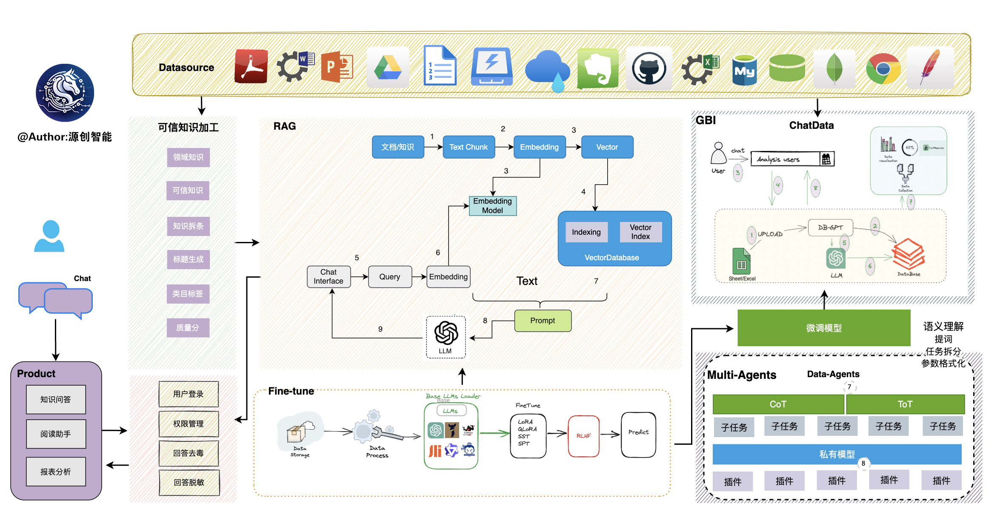
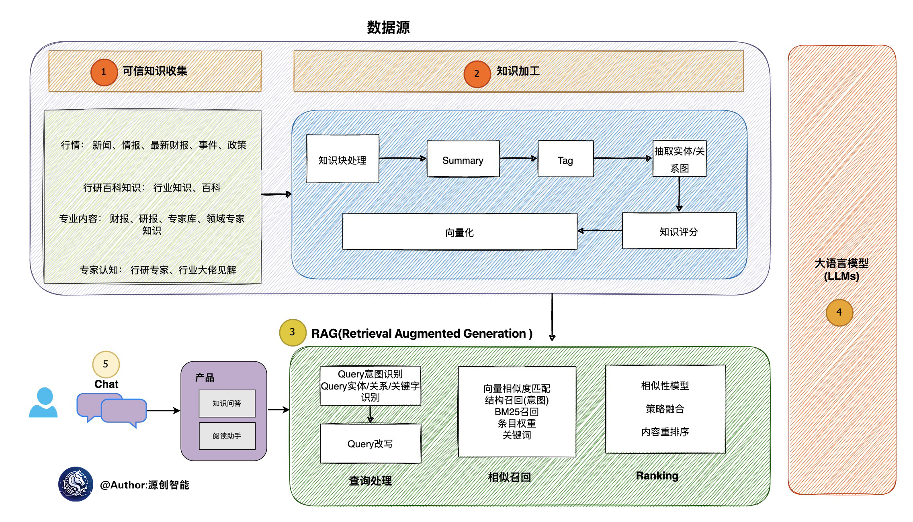
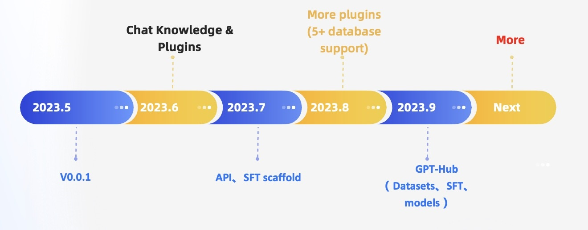

# 白泽智语: 用私有化LLM技术定义下一代交互方式

  

## BAIZEAI(白泽智语) 是什么？
白泽智语是一个开源的数据库领域大模型框架。目的是构建大模型领域的基础设施，通过开发多模型管理、Text2SQL效果优化、RAG框架以及优化、Multi-Agents框架协作等多种技术能力，让围绕数据库构建大模型应用更简单，更方便。 

数据3.0 时代，基于模型、数据库，企业/开发者可以用更少的代码搭建自己的专属应用。

## 目录

- [架构方案](#架构方案)
- [特性简介](#特性一览)
- [路线图](#路线图)

## 特性一览
- **私域问答&数据处理&RAG**

  支持内置、多文件格式上传、插件自抓取等方式自定义构建知识库，对海量结构化，非结构化数据做统一向量存储与检索

- **多数据源&GBI**

  支持自然语言与Excel、数据库、数仓等多种数据源交互，并支持分析报告。

- **自动化微调**

  围绕大语言模型、Text2SQL数据集、LoRA/QLoRA/Pturning等微调方法构建的自动化微调轻量框架, 让TextSQL微调像流水线一样方便。

- **数据驱动的Agents插件**

  支持自定义插件执行任务，原生支持Auto-GPT插件模型，Agents协议采用Agent Protocol标准

- **多模型支持与管理**

  海量模型支持，包括开源、API代理等几十种大语言模型。如LLaMA/LLaMA2、Baichuan、ChatGLM、文心、通义、智谱等。当前已支持如下模型: 

  - 新增支持模型
    - 🔥🔥🔥  [SOLAR-10.7B](https://huggingface.co/upstage/SOLAR-10.7B-Instruct-v1.0)
    - 🔥🔥🔥  [Mixtral-8x7B](https://huggingface.co/mistralai/Mixtral-8x7B-Instruct-v0.1)
    - 🔥🔥🔥  [Qwen-72B-Chat](https://huggingface.co/Qwen/Qwen-72B-Chat)
    - 🔥🔥🔥  [Yi-34B-Chat](https://huggingface.co/01-ai/Yi-34B-Chat)
  - 支持在线代理模型 
    - [x] [OpenAI·ChatGPT](https://api.openai.com/)
    - [x] [百川·Baichuan](https://platform.baichuan-ai.com/)
    - [x] [阿里·通义](https://www.aliyun.com/product/dashscope)
    - [x] [百度·文心](https://cloud.baidu.com/product/wenxinworkshop?track=dingbutonglan)
    - [x] [智谱·ChatGLM](http://open.bigmodel.cn/)
    - [x] [讯飞·星火](https://xinghuo.xfyun.cn/)
    - [x] [Google·Bard](https://bard.google.com/)
    - [x] [Google·Gemini](https://makersuite.google.com/app/apikey)
  
- **隐私安全**

  通过私有化大模型、代理脱敏等多种技术保障数据的隐私安全。

## 架构方案
整个白泽智语的架构，如下图所示

  

核心能力主要有以下几个部分:
- **RAG(Retrieval Augmented Generation)**，RAG是当下落地实践最多，也是最迫切的领域，白泽智语目前已经实现了一套基于RAG的框架，用户可以基于白泽智语的RAG能力构建知识类应用。 

- **GBI**：生成式BI是白泽智语项目的核心能力之一，为构建企业报表分析、业务洞察提供基础的数智化技术保障。 

- **微调框架**:  模型微调是任何一个企业在垂直、细分领域落地不可或缺的能力，白泽智语提供了完整的微调框架，实现与白泽智语项目的无缝打通，在最近的微调中，基于spider的准确率已经做到了82.5%

- **数据驱动的Multi-Agents框架**:  白泽智语提供了数据驱动的自进化微调框架，目标是可以持续基于数据做决策与执行。 

- **数据工厂**: 数据工厂主要是在大模型时代，做可信知识、数据的清洗加工。 

- **数据源**: 对接各类数据源，实现生产业务数据无缝对接到白泽智语核心能力。 

### RAG生产落地实践架构

  

### 多语言切换

在.env 配置文件当中，修改LANGUAGE参数来切换使用不同的语言，默认是英文(中文zh, 英文en, 其他语言待补充)

# 路线图

  

### 知识库RAG检索优化

- [x] Multi Documents
  - [x] PDF
  - [x] Excel, csv
  - [x] Word
  - [x] Text
  - [x] MarkDown
  - [ ] Code
  - [ ] Images 
- [x] RAG
- [ ] Graph Database
  - [ ] Neo4j Graph
  - [ ] Nebula Graph
- [x] Multi Vector Database
  - [x] Chroma
  - [x] Milvus
  - [x] Weaviate
  - [x] PGVector
  - [ ] Elasticsearch
  - [ ] ClickHouse
  - [ ] Faiss 

### 多数据源支持

- 支持数据源

  - [x] MySQL
  - [x] PostgresSQL
  - [x] Spark
  - [x] DuckDB
  - [x] Sqlite
  - [x] MSSQL
  - [x] ClickHouse
  - [x] StarRocks
  - [ ] Oracle
  - [ ] Redis
  - [ ] MongoDB
  - [ ] HBase
  - [x] Doris
  - [ ] DB2
  - [ ] Couchbase
  - [ ] Elasticsearch
  - [ ] OceanBase
  - [ ] TiDB

### 多模型管理与推理优化
- [x] 集群部署
- [x] fastchat支持
- [x] vLLM 支持
- [x] 上层接口兼容Openai
- [ ] 云原生环境与Ray环境支持
- [ ] 注册中心引入nacos
- [ ] Embedding模型扩充，优化

### Agents与插件市场
- [x] 多Agents框架
- [x] 自定义Agents
- [x] 插件市场
- [ ] CoT集成
- [ ] 丰富插件样本库
- [ ] 支持AutoGPT协议
- [ ] Multi-agents & 可视化能力打通，定义LLM+Vis新标准

### 测试评估能力建设
- [ ] 知识库的数据文本集
- [ ] 问题集合 [easy、medium、hard]
- [ ] 评分机制
- [ ] Excel + DB库表的测试评估

### 成本与可观测性 
- [x] debugging
- [ ] 可观测性
- [ ] 推理预算

### Text2SQL微调
- support llms
  - [x] LLaMA
  - [x] LLaMA-2
  - [x] BLOOM
  - [x] BLOOMZ
  - [x] Falcon
  - [x] Baichuan
  - [x] Baichuan2
  - [x] InternLM
  - [x] Qwen
  - [x] XVERSE
  - [x] ChatGLM2

-  SFT模型准确率 
截止20231010，我们利用本项目基于开源的13B大小的模型微调后，在Spider的评估集上的执行准确率，已经超越GPT-4!
